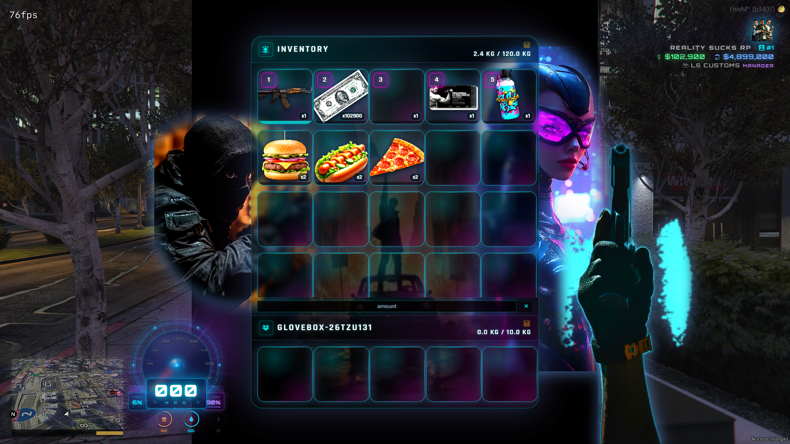

<p align="center">
  
</p>

<p align="center">
  <a href="https://reality-sucks-rp-webstore.tebex.io/package/7449247"></a>
  <a href="https://reality-sucks-rp-webstore.tebex.io/"></a>
  <a href="https://discord.gg/e9V3rPHySx"></a>
</p>

> I build my own FiveM scripts and complete server setups: shops, weapons, phones, racing, customs, garages, dealerships, zombie apocalypse systems, warfare, Phantom encounters, UI and more. My resources are tested in my own server builds and can be configured around the server owner's setup.

# ⚡ RealitySucksRP qb-inventory — Custom UI Edition ⚡

# RS Punk Inventory

### A modern, aggressive inventory built for serious FiveM roleplay

I rebuilt the traditional inventory experience into something that feels more modern, more visual, and better suited for today’s RP servers.

**RS Punk Inventory** combines a neon cyber-punk presentation with a hardened server-authoritative inventory system designed around real gameplay: cash, weapons, floor drops, vehicle storage, item transfers, and fast day-to-day RP interactions.

The interface is designed to look like part of the game rather than a plain utility menu, while the backend focuses heavily on keeping inventory state accurate between the player, server, HUD, and other resources.

## 💵 Physical Cash That Actually Works

Cash can exist as a real inventory item while remaining synchronized with the player’s actual spending power.

That means when cash is:

- Given to a player
- Earned from another resource
- Spent at a vehicle shop or business
- Dropped on the ground
- Picked back up
- Added or removed through QBCore money functions

…the **cash item, HUD balance, and server-side buying power stay together**.

Large cash stacks are also presented naturally inside the inventory:

**$34,601,900**

instead of an ugly item count such as `x34601900`.

## 🛡️ Hardened Floor Drop System

I also rebuilt the floor-drop synchronization flow to combat one of the most frustrating inventory problems: ghost items and duplicated visual stacks.

Floor drops use authoritative server inventory snapshots instead of trusting the browser to guess what happened.

This helps prevent situations where:

- An item appears in both the inventory and on the floor
- Cash returns after being dropped
- Weapons visually duplicate
- Items disappear until reopening inventory
- Failed moves leave ghost items behind
- Rapid clicking causes overlapping transactions
- A failed floor bag silently eats the item

Drop operations include request locking, duplicate-request protection, reconciliation, and refund protection when a floor bag cannot be completed.

## 🚀 Designed for RP

**Highlights include:**

- ⚡ Neon cyber-punk inventory interface
- 💵 Physical cash item support
- 💰 Live cash/HUD synchronization
- 🛡️ Server-authoritative cash state
- 💲 Currency formatting for large cash stacks
- 🔫 Weapons and weapon metadata
- 📦 Floor item drops
- 🚗 Glovebox inventory
- 🚘 Vehicle storage interaction
- 🤝 Player-to-player item transfers
- 📚 Stack splitting and merging
- ⚖️ Inventory weight and slot limits
- 🔢 Hotbar support
- 🔄 Server-authoritative move reconciliation
- 🛡️ Duplicate floor-drop protection
- ↩️ Failed-drop item refunds
- 🔧 Automatic inventory-state recovery
- 🧩 Compatibility support for existing qb-inventory style integrations

## 🔥 Open Source QBCore Inventory • Custom Menu UI • Cash-as-Item • Weapon Attachments • Server Branding

Bring your server inventory to life with a fully upgraded **QBCore qb-inventory** packed with modern backend improvements, custom menu visuals, server branding, cash-as-item support, weapon inspection, better drops, HUD compatibility, and easy image customization.

This is not just a basic reskin.

This is a polished inventory package built for server owners who want their menu to actually feel custom.

## 🎨 Custom Menu UI

This inventory includes a custom visual menu UI with **3 major image slots** that server owners can replace, move, resize, or redesign.

Use the 3 image slots for:

- 🤖 Cyberpunk characters
- 🎭 Server mascots
- 🏙️ City RP branding
- 🕶️ Gang RP themes
- 🎃 Seasonal events
- 🚔 Police / criminal themes
- 💀 Horror themes
- ⚡ Your own custom server art

The UI is designed so you can make it match your server without touching the inventory brain.

## 🖼️ Change the Images / Logo / Server Name

Server owners can customize:

- ✅ Main menu image 1
- ✅ Main menu image 2
- ✅ Main menu image 3
- ✅ Server logo
- ✅ Server name
- ✅ Background art
- ✅ Watermark image
- ✅ Image size
- ✅ Image position
- ✅ Image opacity
- ✅ UI colors

Most visual edits are done in:

`html/main.css`

Images are usually inside:

`html/images/`

`html/*.png`

## 🛠️ Safe Files to Customize

For visual edits, you can safely edit:

`html/main.css`

`html/index.html`

`html/images/`

`html/*.png`

Avoid editing these unless you know what you are doing:

`client/main.lua`

`server/main.lua`

`server/functions.lua`

`html/app.js`

`config/config.lua`

Those files control important inventory logic like item use, hotkeys, drops, cash-as-item, server syncing, and framework behavior.

## 💵 Cash-As-Item Support

This inventory supports cash as a real inventory item.

When enabled, players can:

- 💰 Receive cash as an item
- 💰 Drop cash on the floor
- 💰 Pick cash back up
- 💰 Move cash around inventory
- 💰 See cash inside the inventory UI
- 💰 Sync cash with compatible HUDs

Cash-as-item requires the proper QBCore player money integration and a `cash` item inside:

`qb-core/shared/items.lua`

## 🔫 Weapon Attachment Inspection

The inventory includes an upgraded weapon attachment inspection panel.

Players can inspect supported weapons and view attachment categories such as:

- 🔦 Flashlight
- 🎯 Optics
- 🔧 Grip
- 🔫 Muzzle
- 📦 Magazine
- 🎨 Tint / skin

Installed attachments can be displayed in a cleaner visual panel instead of a basic old attachment list.

## 🍔 Item Decay / Freshness Support

This inventory includes optional item expiry / freshness support.

Useful for:

- 🍕 Food decay
- 🥤 Drinks
- 🧪 Medical items
- 🥩 Survival RP items
- 🧟 Zombie RP loot
- ⏳ Time-sensitive items

When configured, items can show freshness / expiry information through server-time synced data.

## 🧩 HUD Compatibility

This inventory includes an optional HUD hide/show hook.

If your HUD supports a `SetHUDLifeVisible` export, the HUD can automatically hide when inventory opens and return when inventory closes.

```lua
CustomHUD = {
    Enabled = true,
    ResourceName = 'your-hud-resource-name',
    ExportName = 'SetHUDLifeVisible'
}
```

## 📦 Requirements

- FiveM
- QBCore / `qb-core`
- `qb-weapons`
- `oxmysql`
- Properly configured QBCore items

## 🛠️ Installation

1. Back up your existing inventory and player data.
2. Place the resource inside your server resources folder.
3. Keep the resource folder named `qb-inventory`.
4. Start dependencies first:

```cfg
ensure qb-core
ensure qb-weapons
ensure oxmysql
ensure qb-inventory
```

5. Configure cash, HUD, item, and inventory options.
6. Restart the server.

## ❤️ Credits

Original QB Inventory foundation by the QBCore Framework project.

Custom UI, additional systems, synchronization hardening, integration work, polish, and RealitySucksRP release by **RealitySucksRP**.

## 📜 License

This project remains subject to the open-source licensing requirements of the upstream QB Inventory code included in the resource.

---

### ⚡ RS Punk Inventory

**A high-energy inventory for modern RP servers — built around style, physical cash, authoritative synchronization, and dependable everyday gameplay.**
